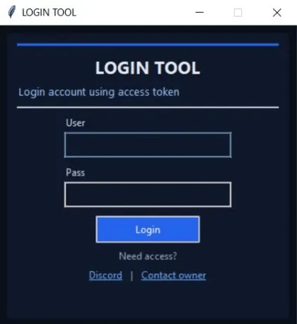
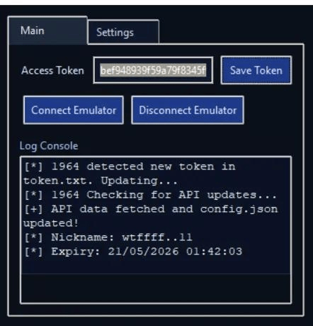

# 🚀 1964 Login Tool

<div align="center">

### Secure Authentication & Emulator Management Tool

Website: https://logintool.ff1964.me

Developed by **Shaikh Muhammad Saad Sultanali (1964)**

</div>

---

## 📸 Preview

<div align="center">

<table>
<tr>
<td width="50%">

### Login Screen


</td>

<td width="50%">

### Dashboard


</td>
</tr>
</table>

</div>

---

## ✨ Features

- 🔐 Secure Login Authentication
- 🎫 Access Token System
- 💾 Save & Manage Tokens
- 🖥️ Emulator Connection Support
- 🔄 Automatic Token Detection
- 🌐 API Configuration Updates
- 📋 Real-Time Console Logs
- 👤 Account Information Display
- ⏳ Token Expiry Tracking
- ⚡ Lightweight & Fast Interface

---

## 📖 About

1964 Login Tool is a desktop application designed to provide secure access-token authentication and emulator management through a clean and user-friendly interface.

The tool automatically:

- Detects newly generated tokens
- Updates API configurations
- Retrieves account information
- Displays live status logs
- Manages emulator connectivity

---

## 🖥️ Dashboard Functions

### Authentication
- Login using credentials
- Access token verification
- Secure account access

### Token Management
- Save Access Tokens
- Update Tokens
- Auto Token Detection

### Emulator Control
- Connect Emulator
- Disconnect Emulator
- Connection Status Monitoring

### Console Monitoring
Real-time logs showing:

```text
[*] Token detection
[*] API update checks
[+] Configuration updates
[*] User information
[*] Expiry status
```

---


## ⚙️ Requirements

- Windows 10/11
- Internet Connection
- Valid Access Token
- Supported Android Emulator

---

## 🌐 Official Website

Visit the official website:

### https://logintool.ff1964.me

---

## 👨‍💻 Developer

### Shaikh Muhammad Saad Sultanali (1964)

Passionate Developer focused on desktop applications, automation tools, emulator integrations, and modern software solutions.

### Links

- 🌐 Website: https://logintool.ff1964.me
- 💻 GitHub: https://github.com/gaara1964
- 📧 Email: shaikhsaadsultanali2004@gmail.com
- 💬 Discord: @gaara.1964

---

## 🤝 Support

Need access or assistance?

- Visit the official website
- Contact the developer
- Join the Discord community

---

## ⚠️ Disclaimer

This software is provided for educational and development purposes only.

Users are responsible for ensuring compliance with all applicable software terms, policies, and regulations.

---

<div align="center">

### Made with ❤️ by 1964

**https://logintool.ff1964.me**

</div>
